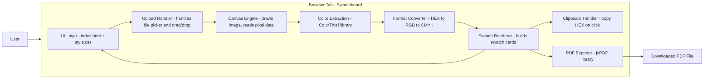
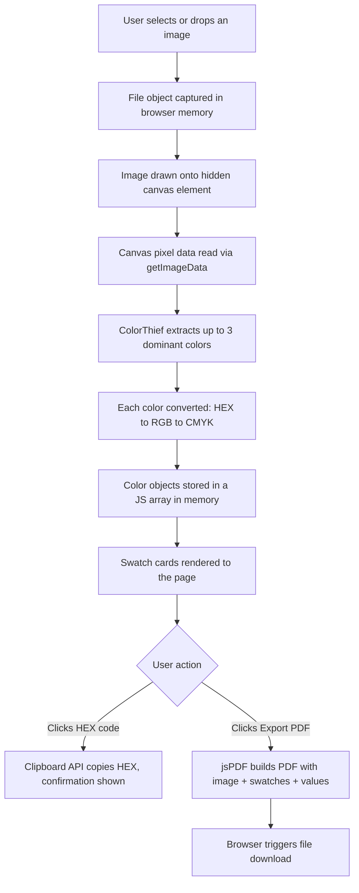

# Swatchboard — Architecture

**Status:** Approved — Day 2
**Companion docs:** PRD, Implementation Blueprint, SCHEMA.md, API.md, UI-WIREFRAMES.md, PROJECT-STRUCTURE.md

---

## 1. Architecture Summary

Swatchboard is a **100% client-side, static web application**. There is no backend server, no database, and no network API. Everything — image handling, color extraction, format conversion, and PDF generation — runs inside the user's browser tab using JavaScript libraries loaded via CDN.

This is possible because:
- Image processing (reading pixels, extracting dominant colors) can be done entirely with the browser's native **Canvas API**.
- PDF generation can be done entirely client-side with a JavaScript library (**jsPDF**).
- There's no need to store or share data between users or sessions in v1.0.

**Why this matters:** zero hosting cost, zero backend maintenance, zero attack surface for user data (nothing ever leaves the browser), and a much simpler build for a 9-18 hour time budget.

---

## 2. Component Diagram

---

## 3. Data Flow

**Key point:** the image file never leaves the browser. No upload to any server occurs at any point — extraction and export both happen locally using data already in memory.

---

## 4. Request Lifecycle (Single Page Load)

Since there's no server request/response cycle for app functionality, the "lifecycle" here is the in-browser event sequence for one full user session:

1. **Page load:** `index.html` loads, pulls in `style.css` and the CDN scripts for ColorThief and jsPDF, then `app.js` initializes event listeners.
2. **Upload event:** either a `change` event (file picker) or a `drop` event (drag-and-drop) fires, both routed to the same `handleFile(file)` function.
3. **Validation:** `handleFile` checks the file is a valid image type; invalid files short-circuit to an error message with no further processing.
4. **Extraction:** valid images are drawn to canvas and passed to ColorThief, which returns a palette (max 3 colors).
5. **Conversion + Render:** each color is converted to RGB/CMYK and rendered as a swatch card.
6. **User interaction loop:** the user can click any HEX code (copy) or the Export button (PDF) any number of times without re-uploading, and can upload a new image at any time to restart the cycle from step 2.

---

## 5. AI Interaction

**Not applicable.** Swatchboard's "intelligence" (color extraction) is deterministic pixel-clustering math (via ColorThief), not an AI/ML model or API call. There is no LLM or AI service integrated into the product itself — Claude's role is purely as the development assistant building the tool, not as a runtime dependency of the shipped product.

---

## 6. External Services

| Service | Role | Notes |
|---|---|---|
| **ColorThief (CDN)** | Color extraction library | Loaded via `<script>` tag, runs entirely client-side, no API key, no network calls at runtime |
| **jsPDF (CDN)** | PDF generation library | Loaded via `<script>` tag, runs entirely client-side, no API key, no network calls at runtime |
| **GitHub Pages** | Static hosting | Serves the static files publicly; no server-side logic |
| **GitHub** | Version control / source of truth | Hosts the repository; browser-based editing per builder's workflow |

No other third-party services, APIs, or accounts are required for v1.0.

---

## 7. Why This Architecture Fits the Constraints

- **Skill level fit:** no backend language, no server frameworks, no database queries to learn — just HTML/CSS/JS, matching the builder's current skill level with AI support for the JS logic.
- **Time budget fit:** zero setup/configuration overhead (no server provisioning, no database migrations) — every hour goes toward the actual product.
- **Cost fit:** entirely free — static hosting + CDN libraries have no usage costs.
- **Reliability fit:** no server means no server downtime; the only failure points are the user's own browser and network connection to load the page once.
