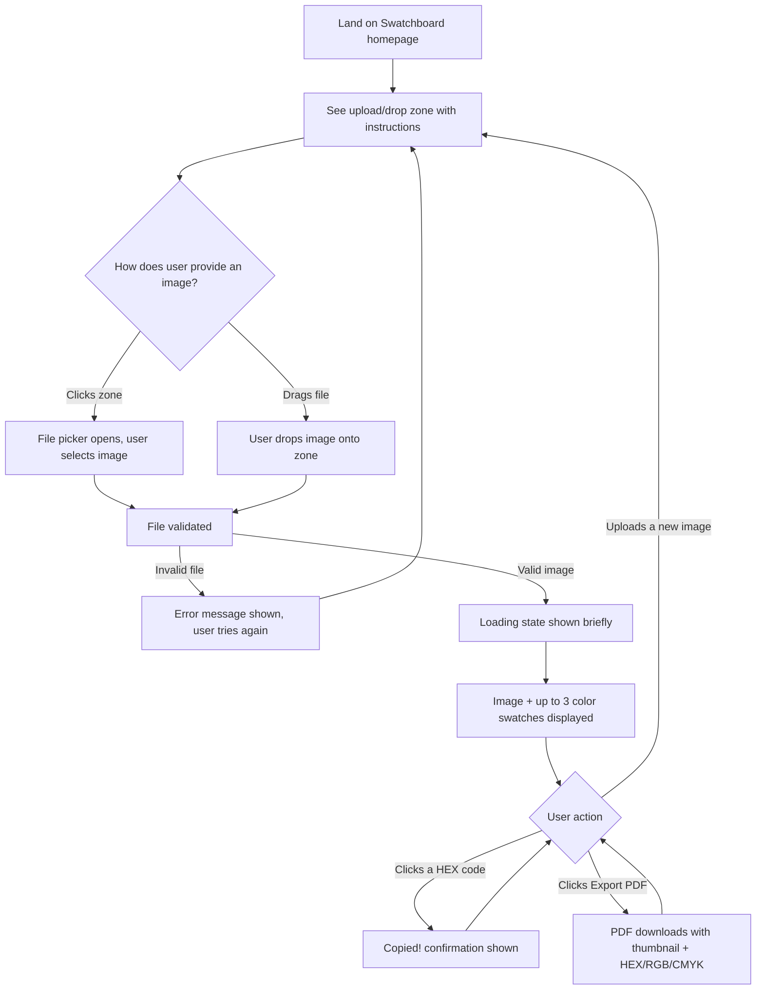

# Swatchboard — UI & User Flow

**Status:** Approved — Day 2

---

## 1. Product Is a Single Screen

Swatchboard is intentionally a **one-page application** — there is no navigation, no routing, and no multiple views. Every screen state below is the *same page* changing what it displays based on `appState` (see SCHEMA.md). This keeps the build simple and matches the PRD's tight v1.0 scope.

---

## 2. User Flow Diagram



---

## 3. Screen States (Low-Fidelity Wireframes)

Since this is one page with four states, each is sketched below in text-wireframe form.

### 3.1 State: `idle` (Initial Load)

```
┌──────────────────────────────────────────────┐
│               🎨  Swatchboard                  │
│   Extract a color palette from any image      │
│                                                │
│   ┌──────────────────────────────────────┐    │
│   │                                        │   │
│   │      ⬆  Drag & drop an image here      │   │
│   │         or click to browse             │   │
│   │                                        │   │
│   └──────────────────────────────────────┘    │
│                                                │
│              Made with Swatchboard             │
└──────────────────────────────────────────────┘
```
- Upload zone is the clear visual focus, centered, generous padding
- Short instructional subtext under the title so first-time users aren't confused

### 3.2 State: `processing`

```
┌──────────────────────────────────────────────┐
│               🎨  Swatchboard                  │
│                                                │
│   ┌──────────────────────────────────────┐    │
│   │         [ uploaded image preview ]     │   │
│   └──────────────────────────────────────┘    │
│                                                │
│               Processing...                    │
│                                                │
└──────────────────────────────────────────────┘
```
- Image preview appears immediately (feels fast/responsive)
- Simple text (or subtle spinner) indicates extraction is in progress

### 3.3 State: `results`

```
┌──────────────────────────────────────────────┐
│               🎨  Swatchboard                  │
│                                                │
│   ┌──────────────────────────────────────┐    │
│   │         [ uploaded image preview ]     │   │
│   └──────────────────────────────────────┘    │
│                                                │
│   ┌────────────┐ ┌────────────┐ ┌───────────┐│
│   │ ■ Color 1   │ │ ■ Color 2   │ │ ■ Color 3  ││
│   │ #3A5F8A     │ │ #E8C07D     │ │ #2C2C2C    ││
│   │ RGB 58,95,  │ │ RGB 232,192,│ │ RGB 44,44, ││
│   │     138     │ │     125     │ │     44     ││
│   │ CMYK 58,31, │ │ CMYK 0,17,  │ │ CMYK 0,0,  ││
│   │   0,46      │ │   46,9      │ │   0,83     ││
│   └────────────┘ └────────────┘ └───────────┘│
│                                                │
│           [ ⬇ Export PDF Swatch Sheet ]        │
│                                                │
│         Upload a new image to start over       │
└──────────────────────────────────────────────┘
```
- Three swatch cards side-by-side (stacking vertically on smaller/mobile widths)
- Each HEX code is clickable to copy (click target should feel obviously interactive — cursor pointer + hover state)
- Export button is visually prominent (primary accent color) since it's the key deliverable action

### 3.4 State: `error`

```
┌──────────────────────────────────────────────┐
│               🎨  Swatchboard                  │
│                                                │
│   ┌──────────────────────────────────────┐    │
│   │                                        │   │
│   │      ⬆  Drag & drop an image here      │   │
│   │         or click to browse             │   │
│   │                                        │   │
│   └──────────────────────────────────────┘    │
│                                                │
│   ⚠ Please upload a valid image file.          │
│                                                │
└──────────────────────────────────────────────┘
```
- Returns to the same upload zone as `idle`, with a clear inline error message added below
- No dead-end — user can immediately try again without reloading the page

---

## 4. Micro-interaction: Copy Confirmation

```
Before click:     #3A5F8A
After click:      ✓ Copied!     (reverts to #3A5F8A after ~1.5 seconds)
```

---

## 5. Navigation

There is no navigation menu, no routing, and no separate pages. The only "navigation" is re-triggering the upload zone at any time to restart the flow with a new image — this doubles as the natural way to reset from any state (including `error`).

---

## 6. Why Every Screen Exists

| Screen State | Reason It Exists |
|---|---|
| `idle` | Entry point — must clearly communicate what the tool does and how to start, per PRD's zero-friction vision |
| `processing` | Prevents user confusion during the (short) extraction delay — satisfies FR-10 |
| `results` | The core value delivery screen — satisfies FR-4, FR-5, FR-6, FR-8 |
| `error` | Required for graceful failure per FR-9 — without it, invalid uploads would silently break the app |

No additional screens (settings, history, account, etc.) exist, in line with the PRD's strict v1.0 scope.
